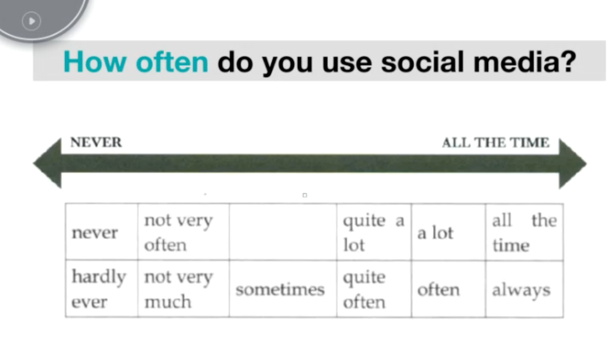

# 课时7
[TOC]

## media

### 新媒体和传统媒体语料

Stricter censorship

Initiative research 主动搜索 

### 高频提问模式

### 喜欢/不喜欢

表达同意的：absolutely/yes/of cause/I agree 

 Yes. I prefer conventional media because they are easier to use than new media. You know, we can use them without the limitation of internet.

lining device: you know/well/actually

表示否定的：No/Not really

Not really, I like new media more than the other beacuse it can help me to keep in touch with friends and colleagues.

keep in touch with sb. 与某人保持联系 

### 频率

### types

be quite active in 

Platform替换website/sites 

stay updated 

### information

memes 梗/段子

social affairs 社会事务

relationship problems 情感问题

there is nothing to do with privacy 不影响....

**抛出某个观点时用basically**

### 消极层面

waste time doing sth.

affect 不好的影响  

impact 中性的影响

语料准备与提问模式对应

## accommodation

### 问题1

distinct 小区

outskirt 郊区

房型+位置

### 问题2 描述：具体化 挖细节

名词升级：加修饰成分

master bedroom 主卧

En suite bathroom 主卧的卫生间

Open-plan living room 连通式的客厅

the same .... as .....

### 喜欢/不喜欢

French window

sth is within walking distance 步行可达

keep track of things == find things

cramped 

run-down 年久失修的，条件差的

refurbishment 

which means 用于paraphrase

what's more 额外的细节

### 变化

the way it is 现在的样子

