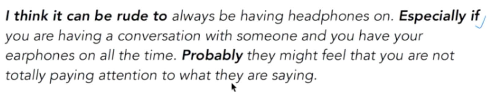

# 课时9

[TOC]

## Headphones

### What type of headphones do you use? Why? 分类/举例

be real experts on sth.

Honestly 后面一般携带negative信息。

Yes / Of cause / Absolutely

cardio exercise / power training

all the time  放在句首。

I use sth. when/if I am doing sth.

tend to do 某种意愿或倾向的时候

when other colleagues work hard

### In what conditions will you not use headpones?

can be rude to have earphones on / wear

have a conversation with sb.

take off earphones and let my ears have a rest

Probably they might feel that ...

## Taking photos

### Do you like to take photographs?/What kind of photos do you like to take?

 

photographer 重音 

amateur  [ /'æmətə/] 生手

like = quite keen on = very fond of = be interested in

a photo/image/picture of scenic views

-scape  ...景

panoramic views

### How often do you take photos?

### Do you want to improve your picture taking skills?

shoot 拍照

